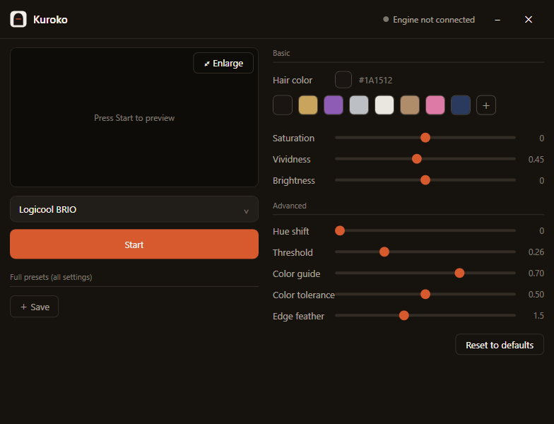
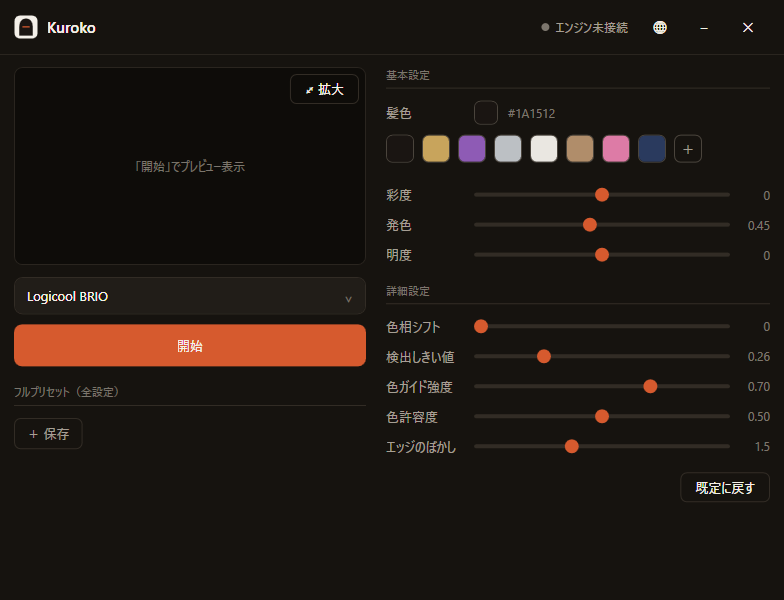

# Kuroko （黒子）

**[English](#english) ・ [日本語](#日本語)**

---

<a id="english"></a>

## English

**Recolor your hair in real time — but only on video calls.**

Kuroko is a Windows tray app that repaints the hair in your webcam feed live, so you can
dye your hair any color in real life yet still show up with a natural, calm look on Zoom,
Meet, or Teams. It outputs a virtual camera, so in your meeting app you just **pick a camera** — no plugins.

The name comes from *kuroko* (黒子), the black-clad stage assistants of kabuki and bunraku
theater: dressed in black, unseen themselves, they make the real performance possible.

<p align="center">
  
</p>

> **Before / After (real hair):**
> <!-- Add your own webcam before/after images here, e.g.: -->
> <!--  -->
> _Coming soon — sample images of hair being recolored live._

### Features

- **AI hair detection.** Segments only the hair and tracks it as you move — no manual masks
  that drift when you turn your head. (BiSeNet face-parsing, run on the GPU via ONNX Runtime + DirectML; no CUDA needed.)
- **Natural recoloring.** Keeps the hair's own shading and shine, replacing only hue and
  saturation. A single **"vividness"** slider blends continuously from natural to bold.
- **Everything is live-adjustable** — color, saturation, brightness, vividness, hue,
  detection threshold, color guide, tolerance, and edge feather.
- **Japanese / English UI**, switchable from the title bar or the tray, applied instantly.
- **Presets** in two flavors: color-only, and full (color + all filter settings).
- **Runs in the tray.** Optional start-on-boot and auto start/stop when a virtual camera is in use.

### Requirements

- Windows 10 / 11 (x64)
- A DirectX 12 capable GPU (runs on modest GPUs via DirectML)
- A webcam
- The [UnityCapture](https://github.com/schellingb/UnityCapture) virtual-camera driver (MIT)

### Install

1. Download **`Kuroko-win-Setup.exe`** from the [latest release](https://github.com/ohsugeek/kuroko/releases/latest) and run it.
2. Install [UnityCapture](https://github.com/schellingb/UnityCapture) and run its `Install/Install.bat` as administrator to register "Unity Video Capture".
3. Launch Kuroko, pick your camera, and click start.
4. In your meeting app's camera setting, choose **Unity Video Capture**.

Later versions update themselves from within the app (tray menu → check for updates).

### How it works

Two processes. If the engine crashes, the GUI survives; native dependencies stay isolated
from the UI.

```
[camera] → KurokoEngine.exe (C#)                         → [Unity Video Capture] → Zoom, etc.
             ├ hair segmentation  BiSeNet face-parsing ONNX (ONNX Runtime + DirectML)
             ├ recolor            HSV blend + color guide + feather
             └ output             UnityCapture shared memory
                    ↑ named pipe  \\.\pipe\kuroko  (live parameter updates)
                    ↓ shared mem  KurokoPreview     (preview frames)
           Kuroko.exe (WPF GUI)
```

Inference and output run on separate threads, so output stays around 30 fps even when
inference runs at ~18 fps.

#### The recoloring model

Painting hair with a flat target color looks fake. Kuroko preserves the **ratio** of the
original brightness `V` and only decides how far to push it toward the target color's
brightness, via an exponential interpolation:

```
new V = V × (target V / average hair V) ^ vividness
```

At `vividness = 0` the original shading is fully preserved (most natural); at `1` it goes
all the way to the target brightness (bold colors like blonde or silver show clearly).
Because it's exponential, the hair's light-to-dark ratio — its texture — is kept at any setting.

### Build from source

You need the .NET 10 SDK.

```bash
# 1) Place the hair-segmentation model (kept out of the repo; it is large).
#    Get resnet18.onnx from yakhyo/face-parsing Releases and put it at:
#      engine-cs/models/resnet18.onnx
#    The 512-input version is required; lower-res re-exports fail to detect hair.

# 2) Build the engine and the GUI.
dotnet build engine-cs/KurokoEngine.csproj -c Release
dotnet build gui/Kuroko/Kuroko.csproj -c Release

# 3) Run the GUI (it launches the engine automatically).
./gui/Kuroko/bin/Release/net10.0-windows/Kuroko.exe
```

To build an installer: `pwsh gui/Kuroko/publish.ps1 -Version <x.y.z>`
(see [gui/Kuroko/RELEASE.md](gui/Kuroko/RELEASE.md)).

### Python prototype (`src/`)

An earlier proof of concept using MediaPipe Selfie Multiclass lives in `src/`. The
production engine is the C# version (`engine-cs/`); the Python code is kept for reference.

```bash
python -m venv venv
./venv/Scripts/pip install -r requirements.txt
./venv/Scripts/python src/tune_gui.py            # parameter-tuning GUI
./venv/Scripts/python src/main.py --preview-only
```

### Limitations

- Detection accuracy can drop under strong backlight or fast motion.
- Capture is fixed at 720p (recoloring at 1080p is too CPU-heavy to hold 30 fps).
- Windows only (the virtual camera uses DirectShow).

### Third-party components

| Component | Purpose | License |
|---|---|---|
| [face-parsing](https://github.com/yakhyo/face-parsing) (BiSeNet) | Hair segmentation | MIT |
| [UnityCapture](https://github.com/schellingb/UnityCapture) | Virtual camera output | MIT |
| ONNX Runtime (DirectML) | Inference | MIT |
| OpenCvSharp | Image processing | Apache-2.0 |
| Velopack | Packaging & auto-update | MIT |
| MediaPipe (Python prototype only) | Segmentation | Apache-2.0 |

Model weights follow the terms of their training data (CelebAMask-HQ). Check the license of
each dataset/model before redistribution or commercial use.

### License

[MIT](LICENSE) © 2026 Kenta Ohsugi

---

<a id="日本語"></a>

## 日本語

**現実では自由に髪を染め、Web会議のときだけ髪をリアルタイムに再着色する。**

Kuroko は、Webカメラ映像の髪だけをリアルタイムに塗り替える Windows 常駐アプリです。
現実では好きな髪色にしながら、Zoom・Meet・Teams では落ち着いた自然な髪色で映れます。
仮想カメラとして出力するので、会議アプリ側は **カメラを選ぶだけ**。プラグインは不要です。

名前は歌舞伎・文楽の「黒子」から。黒をまとい、自らは見えずに本番を成立させる裏方に由来します。

<p align="center">
  
</p>

> **Before / After（実際の髪）:**
> <!-- ここに自分のWebカメラのBefore/After画像を追加してください。例: -->
> <!--  -->
> _準備中 — 実際に髪を再着色しているサンプル画像を掲載予定。_

### 特徴

- **髪だけをAIで自動検出**して追従。手動マスクのように頭を動かすとズレる、ということがない
  （BiSeNet face-parsing を ONNX Runtime + DirectML でGPU推論。CUDA不要）
- **自然な再着色**。髪本来の陰影・ツヤを残し、色相と彩度だけを置き換える。
  「発色」つまみ1本で、自然寄り⇄はっきり発色を連続的に調整
- **全パラメータをライブ調整** — 色・彩度・明度・発色・色相・検出しきい値・色ガイド強度・色許容度・エッジのぼかし
- **日本語 / 英語UI**。タイトルバーまたはトレイから即時に切り替え可能
- **プリセット2系統** — 髪色のみ／フィルタ込みの全設定
- **タスクトレイ常駐**。Windows起動時の自動開始、仮想カメラ利用時の自動開始・停止に対応

### 動作環境

- Windows 10 / 11（x64）
- DirectX 12 対応GPU（控えめなGPUでも動作）
- Webカメラ
- 仮想カメラドライバ [UnityCapture](https://github.com/schellingb/UnityCapture)（MIT）

### インストール

1. [最新リリース](https://github.com/ohsugeek/kuroko/releases/latest) から **`Kuroko-win-Setup.exe`** を入手して実行
2. [UnityCapture](https://github.com/schellingb/UnityCapture) を導入し、`Install/Install.bat` を管理者権限で実行して「Unity Video Capture」を登録
3. Kuroko を起動し、カメラを選んで「開始」
4. 会議アプリのカメラ設定で **Unity Video Capture** を選ぶ

以降のバージョンはアプリ内（トレイメニュー「アップデートを確認」）から自動更新できます。

### 仕組み

2プロセス構成です。エンジンがクラッシュしてもGUIが生き残り、ネイティブ依存をGUIから隔離しています。

```
[カメラ] → KurokoEngine.exe (C#)                        → [Unity Video Capture] → Zoom等
             ├ 髪セグメンテーション  BiSeNet face-parsing ONNX (ONNX Runtime + DirectML)
             ├ 再着色              HSVブレンド＋色ガイド＋フェザー
             └ 出力                UnityCapture 共有メモリ
                    ↑ 名前付きパイプ \\.\pipe\kuroko（パラメータのライブ反映）
                    ↓ 共有メモリ KurokoPreview（プレビュー映像）
           Kuroko.exe (WPF GUI)
```

推論と出力をスレッド分離しているため、推論が18fpsでも出力は約30fpsを保ちます。

#### 再着色の考え方

単純に目標色で塗ると「塗り絵」のように不自然になります。Kuroko は元の明度 `V` の
**比率**を保ったまま、目標色の明るさへどれだけ寄せるかを指数補間で決めます。

```
新しい明度 = 元の明度 × (目標色の明度 / 髪の平均明度) ^ 発色
```

`発色 = 0` なら元の陰影を完全保持（最も自然）、`1` なら目標色の明るさへ全振り
（金髪・銀髪がはっきり出る）。指数補間なので、どの位置でも髪の明暗比＝質感が保たれます。

### ソースからのビルド

.NET 10 SDK が必要です。

```bash
# 1) 髪セグメンテーションのモデルを配置（大容量のためリポジトリには含まれない）
#    yakhyo/face-parsing の Releases から resnet18.onnx を取得し、以下へ置く
#      engine-cs/models/resnet18.onnx
#    ※512入力版が必須。低解像度に再エクスポートした版では髪を検出できない

# 2) エンジンとGUIをビルド
dotnet build engine-cs/KurokoEngine.csproj -c Release
dotnet build gui/Kuroko/Kuroko.csproj -c Release

# 3) GUIを起動（エンジンはGUIが自動で起動する）
./gui/Kuroko/bin/Release/net10.0-windows/Kuroko.exe
```

インストーラの作成は `pwsh gui/Kuroko/publish.ps1 -Version <x.y.z>`
（詳細は [gui/Kuroko/RELEASE.md](gui/Kuroko/RELEASE.md)）。

### Python版プロトタイプ（`src/`）

初期検討として MediaPipe Selfie Multiclass を使ったPython実装が `src/` にあります。
現在の本番エンジンは C# 版（`engine-cs/`）で、Python版は参考用です。

```bash
python -m venv venv
./venv/Scripts/pip install -r requirements.txt
./venv/Scripts/python src/tune_gui.py            # パラメータ調整GUI
./venv/Scripts/python src/main.py --preview-only
```

### 既知の制約

- 強い逆光や激しい動きでは検出精度が落ちることがある
- 取り込みは720p固定（1080pでの再着色はCPU負荷が高く30fpsを維持しにくいため）
- Windows専用（仮想カメラにDirectShowを使うため）

### サードパーティ

| コンポーネント | 用途 | ライセンス |
|---|---|---|
| [face-parsing](https://github.com/yakhyo/face-parsing) (BiSeNet) | 髪セグメンテーション | MIT |
| [UnityCapture](https://github.com/schellingb/UnityCapture) | 仮想カメラ出力 | MIT |
| ONNX Runtime (DirectML) | 推論 | MIT |
| OpenCvSharp | 映像処理 | Apache-2.0 |
| Velopack | 配布・自動更新 | MIT |
| MediaPipe（Python版のみ） | セグメンテーション | Apache-2.0 |

モデルの重みは学習データ（CelebAMask-HQ）の利用条件に従います。再配布や商用利用の前に
各データセット・モデルのライセンスを確認してください。

### ライセンス

[MIT](LICENSE) © 2026 Kenta Ohsugi
